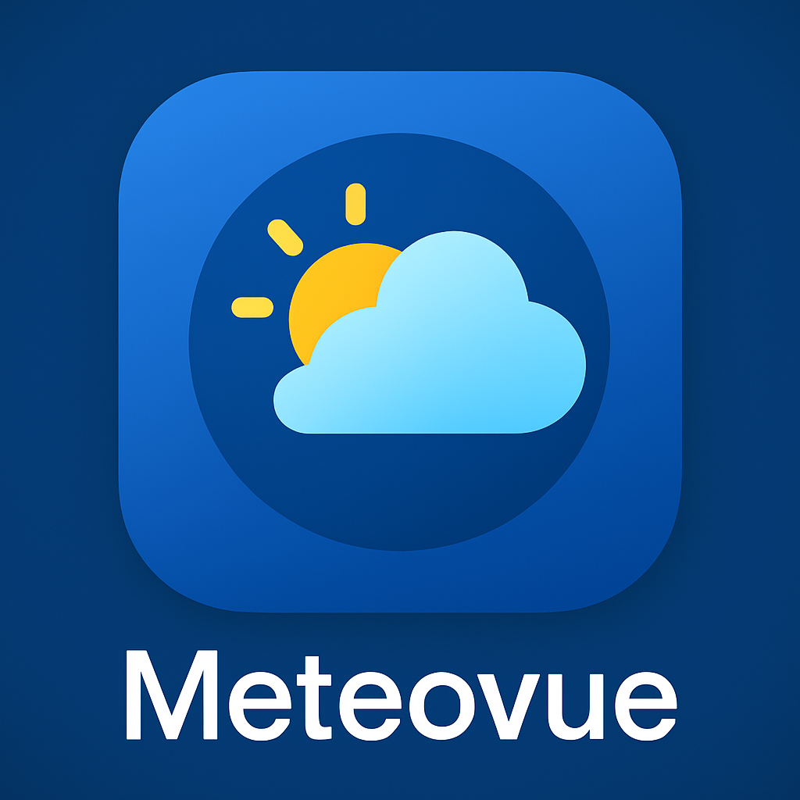

# 🌤️ Meteovue – Weather App  

<p align="center">
  
</p>

A modern weather app built with Flutter 🌍☁️  
Get accurate forecasts, live conditions, and a clean UI powered by OpenWeatherMap API.  

---

## ✨ Features  
✅ 📍 **Location-based Weather** – Auto-detects your location  
✅ 🔍 **City Search** – Find weather for any city worldwide  
✅ 🌡️ **Current Conditions** – Temperature, humidity, wind, visibility  
✅ 📆 **Forecast** – Hourly & 7-day weather outlook  
✅ 🎨 **Modern UI** – Clean, responsive, supports **dark mode**  
✅ 🌐 **Multi-language Support** – Switch between languages easily  
✅ 📊 **Dynamic Icons & Animations** – Beautiful weather visuals  

---

## 🚀 Getting Started  

### 1️⃣ Clone the Repository
```bash
git clone https://github.com/your-username/meteovue.git
cd meteovue
